## Brief Summary

One of the most memorable trips.

### Tokyo

-   Ginza: Luxury shopping and dining; features Grand Seiko, Chanel, Uniqlo flagship, and Kabuki-za Theatre.

-   Harajuku: Trendy street fashion, Takeshita Street, Fender flagship store; close to Meiji Shrine.

-   Ikebukuro: Shopping, anime culture, and transport hub with a local Tokyo atmosphere.

-   Nihonbashi: Historic financial center with traditional shops and department stores like Mitsukoshi and Maruzen for quality Japanese books and stationery.

-   Roppongi: Nightlife, art museums, and embassies.

-   Shibuya: Youth culture, fashion, and entertainment.

-   Shinjuku: Business district with nightlife and skyscrapers.

-   Ueno: Cultural hub with Ueno Park, museums, zoo, and Yoshimi-dōri Avenue's restaurants and shops near Ueno Station.

## Miscellaneous Notes

-   Travel dates: 2016-06-22 - 2016-07-06

-   Airline: ANA to Haneda International Airport

-   Transportation: Japan Pass, Shinkansen, and Tokyo Metro

-   Hotels: Tokyu Stay

## Photos

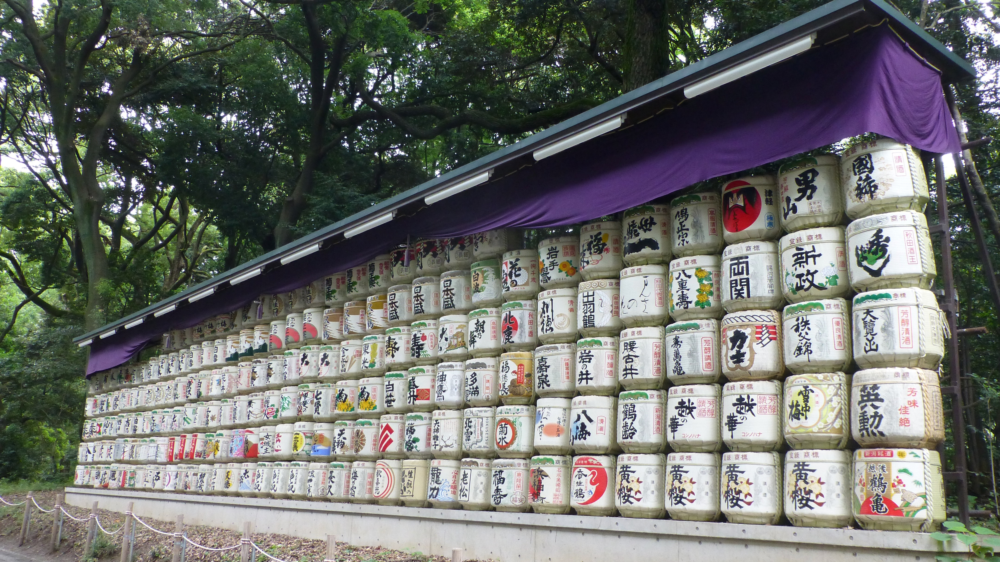{group="Japan"}

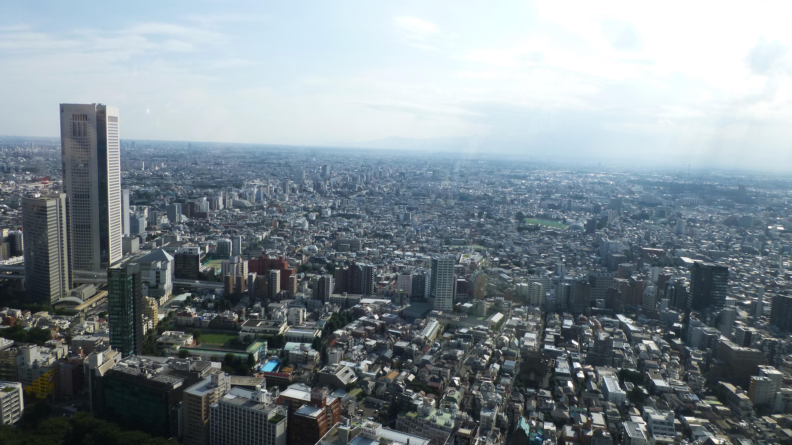{group="Japan"}

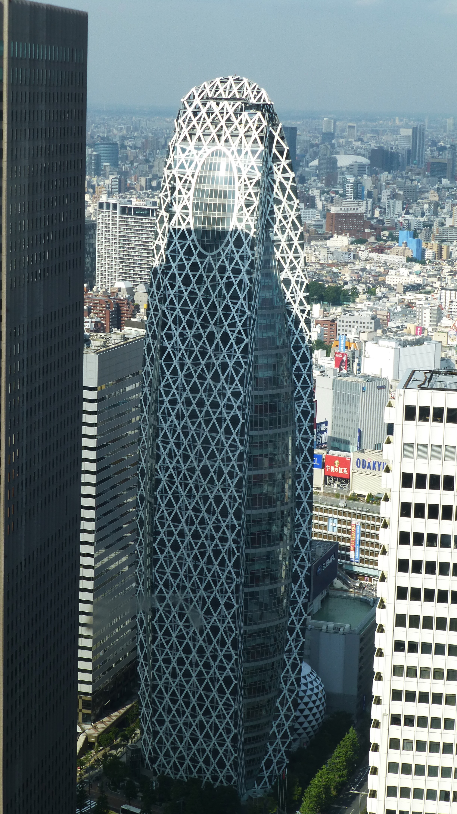{group="Japan"}

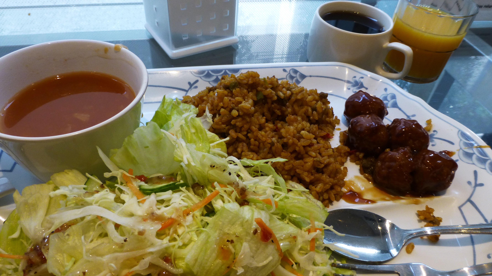{group="Japan"}

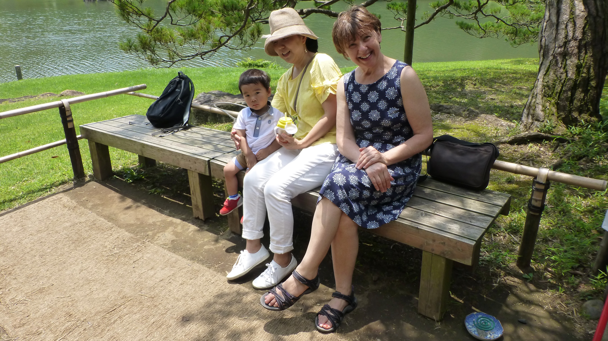{group="Japan"}

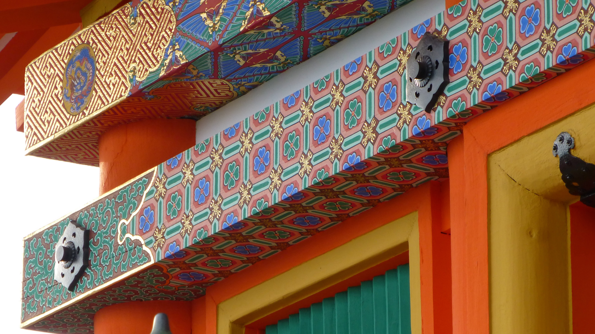{group="Japan"}

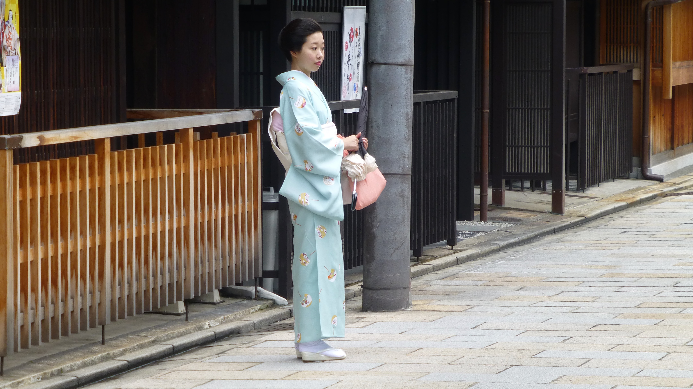{group="Japan"}

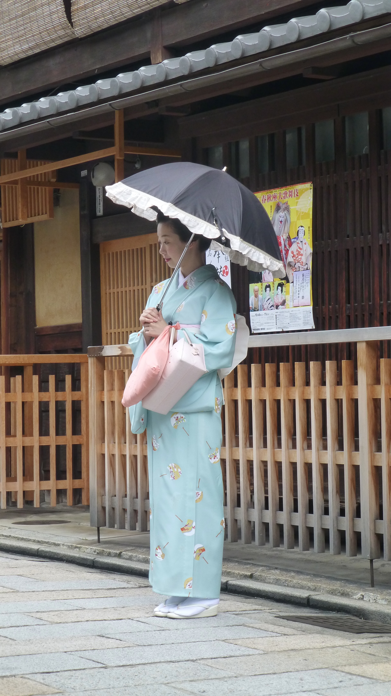{group="Japan"}

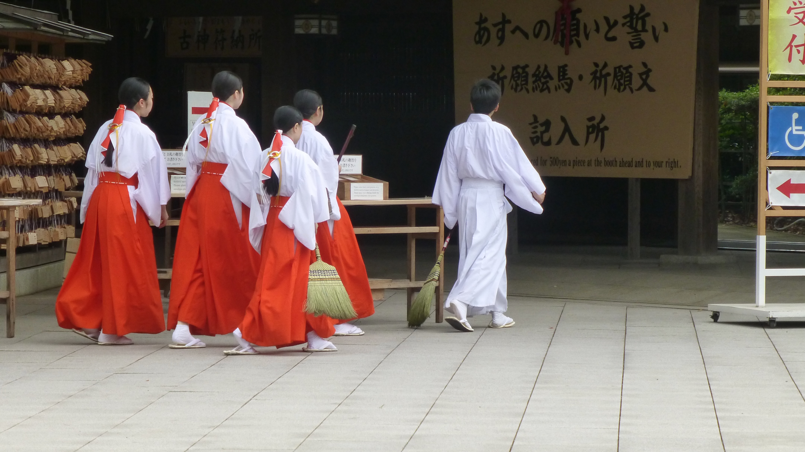{group="Japan"}

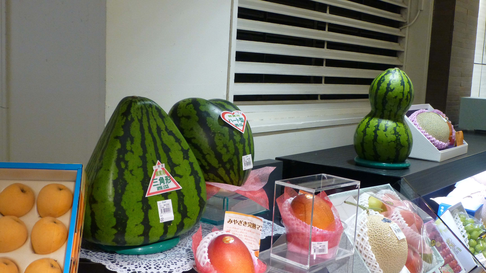{group="Japan"}

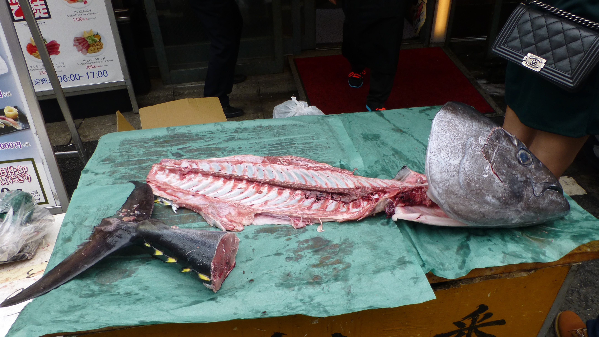{group="Japan"}

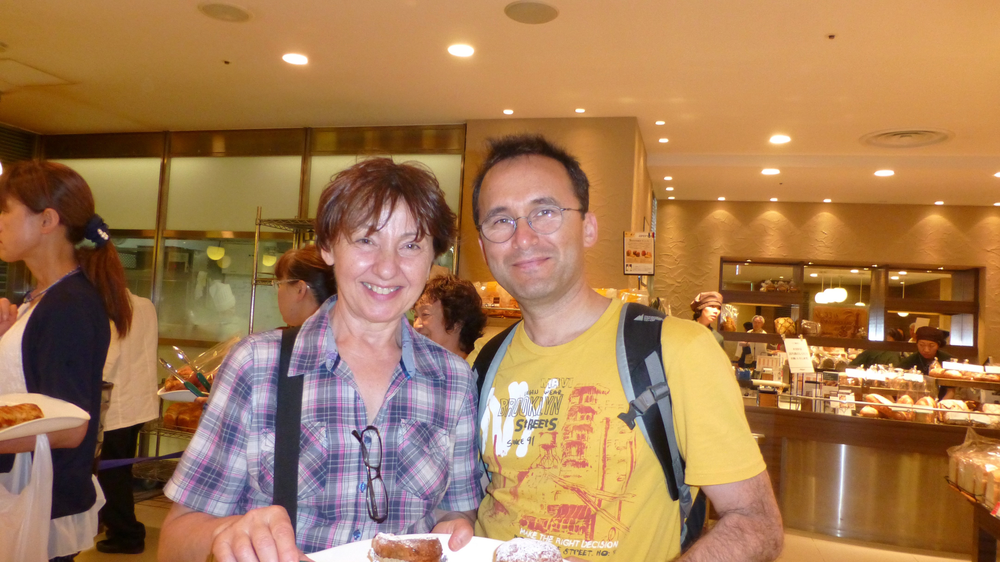{group="Japan"}

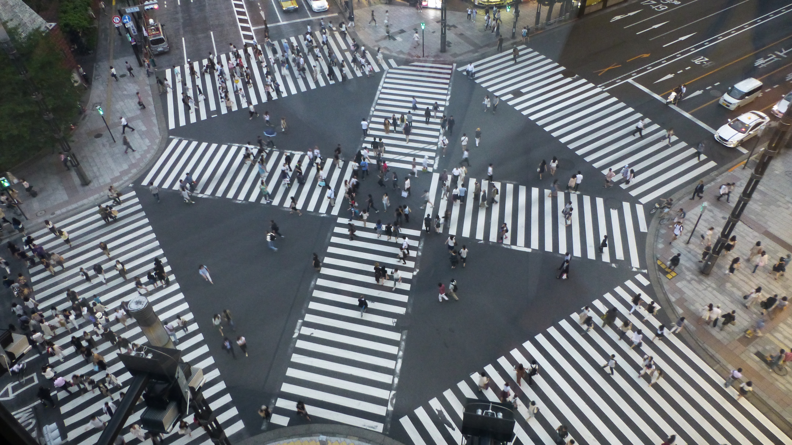{group="Japan"}

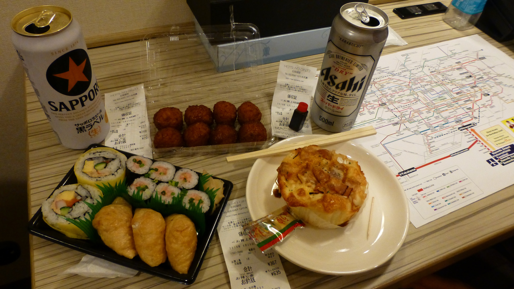{group="Japan"}

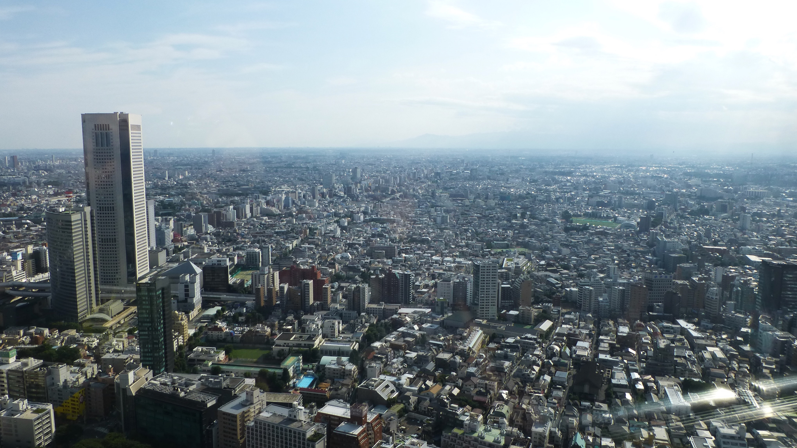{group="Japan"}

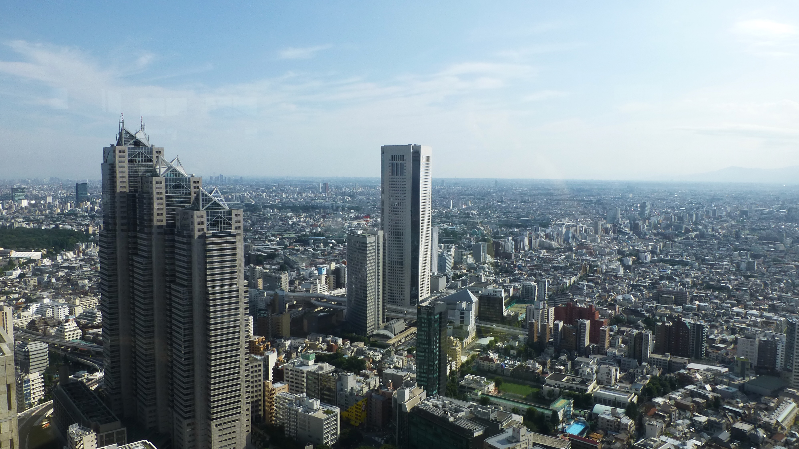{group="Japan"}
