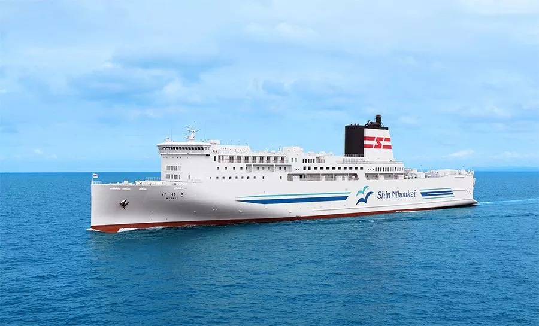
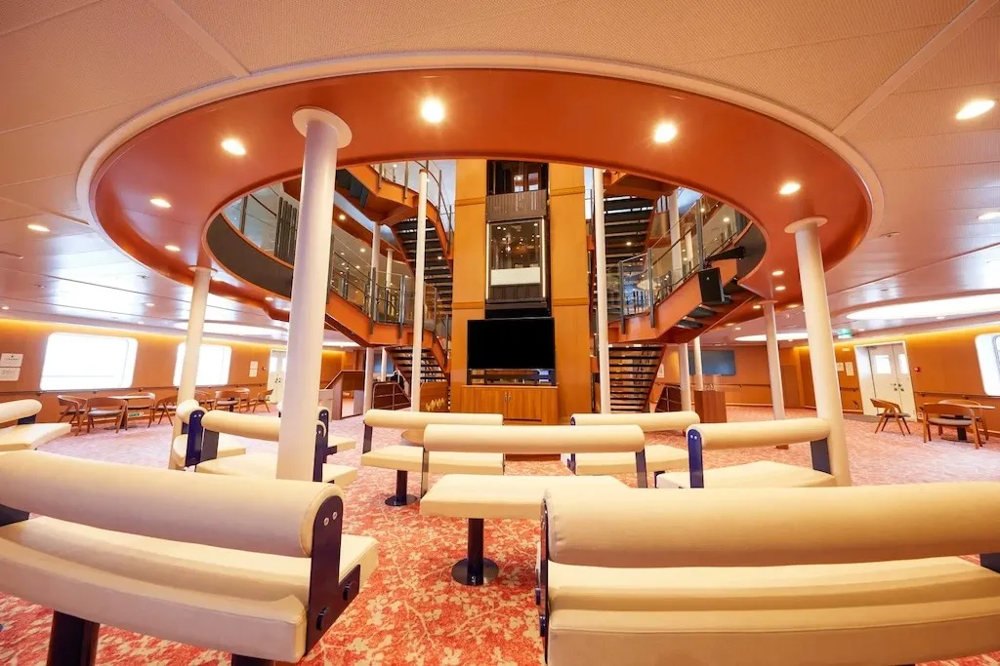
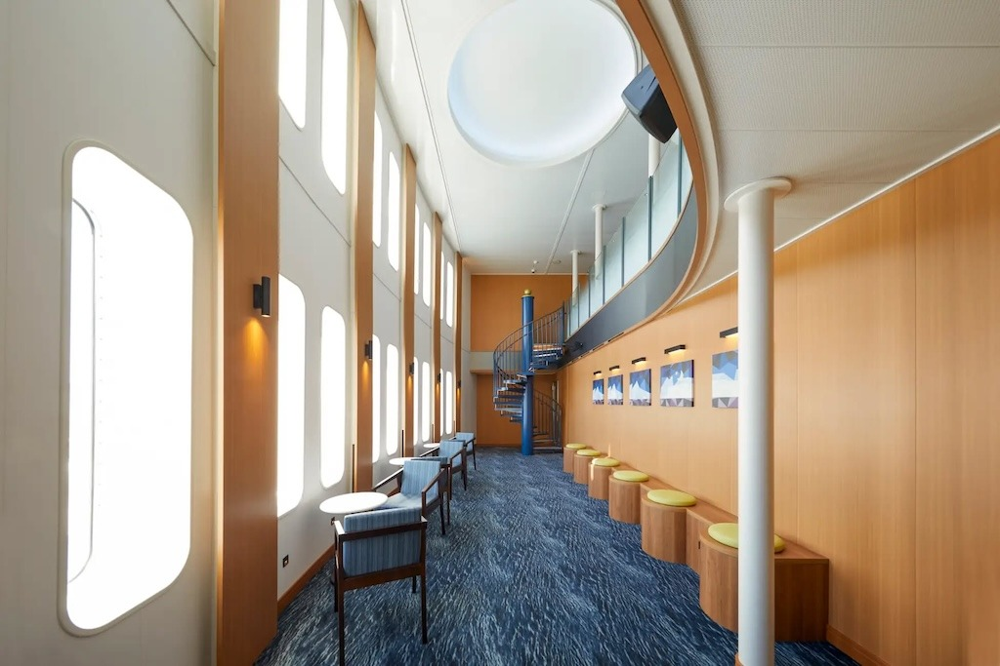

## Brief Summary

Our first trip to Hokkaido. Tokyo (arrival) → Sapporo/Hokkaido → Otaru → ferry → Maizuru → Kyoto → Tokyo (departure).

## Miscellaneous Notes

- Travel dates: 2026-09-19 — 2026-10-07

- Airline: ZIP to NRT Narita International Airport T1

- Transportation:

  - Spring Airlines Japan: Tokyo Narita Intl. T3 to Sapporo New Chitose D, Sun, Sep 20

  - Nippon Rent a Car: Sep 20-26, 2026

  - Shin Nihonkai RoPax Ferry "Keyaki": Otaru-Maizuru Departure: October 1st, 2026 at 11:30 pm, Arrival at Maizuru on October 2nd at 9:15 pm (Total cost ¥52,000)

  - VIP Liner Highway Night Bus, Kyoto to Tokyo on October 3, 2026 arriving on Sunday, October 4.

- Hotels:

  - Hotel Grand Terrace **Chitose**: (Sep 20 - 21, 2026)

  - Keio Plaza Hotel **Sapporo** (Sep 26, 2026-Oct 1, 2026)

  - Super Hotel Higashi-**Maizuru** (check-in: Oct 2, 2026)

  - Sotetsu Fresa Inn Nihombashi-Ningyocho, **Tokyo** (Check-in Sunday, October 4, 2026, Check-out Wednesday, October 7, 2026)

## Photos

{group="keyaki"}

{group="keyaki"}

{group="keyaki"}

## Keyaki

The interior of the RoPax ferry features open spaces including a three-story atrium at the entrance, elevators with clear walls and doors, and a forward salon with a two-story atrium. There is an open-air bath on the top deck and a multipurpose room for enjoying a variety of activities. A variety of cabins are available to provide maritime travel experiences that meet various needs.

### Ship’s Particulars

**Builder:** Mitsubishi Shipbuilding, Shimonoseki Shipyard

**Completed:** November 11, 2025; entered service on November 14, 2025, with a maiden voyage from Otaru to Maizuru.

**Gross Tonnage:** 14,157 tons

**Length:** 199.0 meters

**Beam:** 25.5 meters

**Service Speed:** 28.3 knots (approximately 52.4 kilometres per hour)

**Passenger Capacity:** 286

**Vehicle Capacity:** Approximately 150 trucks and 30 passenger cars

**Named After:** The zelkova tree (keyaki), the official tree of Maizuru City.

**Main Engines:** Four Wärtsilä 14V31 diesel engines

**Configuration:** Twin-shaft (two propellers) with a close-coupled arrangement. This unusual design minimizes efficiency loss compared to twin-screw setups with a single shaft.

**Total Output:** 46,445 horsepower (34,160 kilowatts)

### The Wärtsilä 31 in a nutshell

- Energy efficient – Consumes on average 8–10g/kWh less fuel compared with the closest competitor across its entire load range, saving up to EUR 10,000 per day depending on your vessel type.

- Fuel flexible – Can operate on HFO, MDO, low viscosity or low-sulphur fuels and LNG.

- Easier to maintain plus less downtime – Save up to 20% on maintenance costs; initial maintenance required after 8,000 instead of 1,000 hours; exchange modules reduce downtime by speeding up maintenance.

- Operationally flexible – dual-fuel engine can switch to gas instantaneously when your vessel enters an ECA without losing speed; the Wärtsilä 31 can easily be adapted for different operating profiles and future requirements.